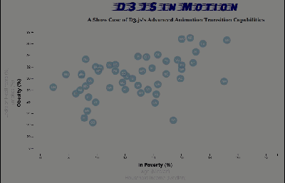

# D3JS-Plot-with-Animated-Transitions

The Web App link is here: https://wenbin-billy-zhao.github.io/D3JS-Plot-with-Animated-Transitions/index.html

### This is a scatter plot with multiple dimensions, by clicking on different dimensions result dynamically updated transition of data

## Process building this graph:

#### Import Health Data Set from csv file (data source: US Census Data)
Using D3.csv import data, then use javascript type cast and manipulate data set

#### Create svg canvas
Add proper transitions for X/Y axis calculations based on screen size of the view port

#### Add scatter plot
#### Add tooltips

#### Add event listeners to react to user input (click on different labels)
The D3 transition properties calcualte new X/Y cordinates of the scatter bubbles and transition them properly.

Enjoy!
